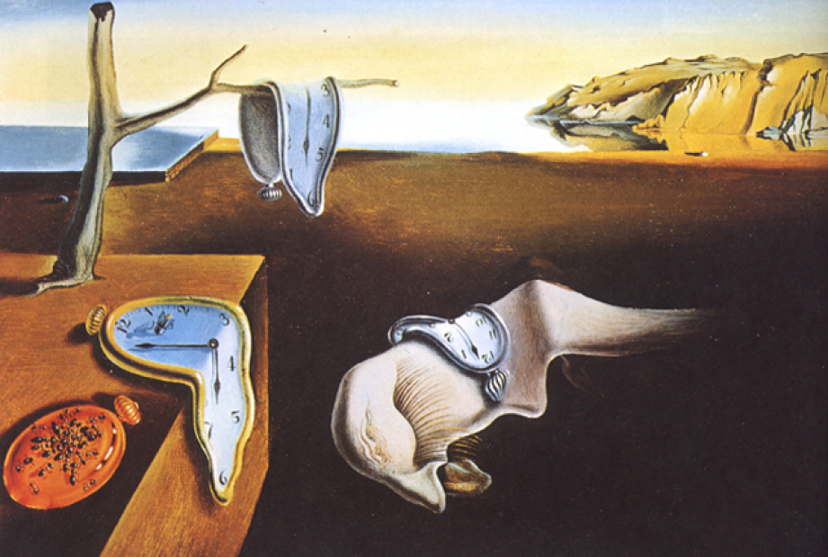

# chrono

Pure clojure time made simple for clj & cljs



## Usage

```clj
(require '[chrono.core :as ch])

(def t
  {:year  2018
   :month 1
   :day   29
   :hour  10
   :min   30
   :sec   15
   :tz    0})

(ch/+ t {:min 100})  ;; => {:year 2018, :month 1, :day 29, :hour 12, :min 10, :sec 15, :tz 0}
(ch/+ t {:min -100}) ;; => {:year 2018, :month 1, :day 29, :hour 8, :min 50, :sec 15, :tz 0}
;; also there is = not= > >= < <= -

(ch/normalize {:min 100}) ;; => {:min 40, :hour 1}

(def iso [:year \- :month \- :day \T :hour \: :min \: :sec])
(ch/format t iso) ;; => "2018-01-29T10:30:15"
(ch/parse "2018-01-29T10:30:15" iso) ;; => {:year 2018, :month 1, :day 29, :hour 10, :min 30, :sec 15}

(ch/format t [:day "/" :month "/" :year]) ;; => "29/01/2018"
(ch/parse  "2018.01.29"  [:year "." :month "." :day]) ;; => {:year 2018, :month 1, :day 29}

;You can specify leading zero padding width by passing pairs [keyword number]
(ch/format {:hour 1 :min 0 :sec 5} [[:hour 1] \: [:min 1] \: [:sec 1]]) ;; => "1:0:5"

(-> t
    (ch/to-tz :ny) ;; => {:year 2018, :month 1, :day 29, :hour 5, :min 30, :sec 15, :tz :ny}
    (ch/to-utc))   ;; => {:year 2018, :month 1, :day 29, :hour 10, :min 30, :sec 15, :tz :0}
;; implement your tz with defmethod ch/day-saving :<your-tz>

;; You can use number as utc-offset
(-> t
    (ch/to-tz 3) ;; => {:year 2018, :month 1, :day 29, :hour 13, :min 30, :sec 15, :tz 3}
    (ch/to-utc)) ;; => {:year 2018, :month 1, :day 29, :hour 10, :min 30, :sec 15, :tz 0}

(require '[chrono.now :as now])

(now/local)     ;; => {:year 2019, :month 9, :day 18, :hour 1, :min 44, :sec 34, :ms 768, :tz 2}
(now/utc)       ;; => {:year 2019, :month 9, :day 17, :hour 23, :min 44, :sec 34, :ms 768, :tz 0}
(now/today)     ;; => {:year 2019, :month 9, :day 18, :tz 2}
(now/utc-today) ;; => {:year 2019, :month 9, :day 17, :tz 0}

(now/tz-offset) ;; => {:hour 2}

(ch/= (assoc (ch/+ (now/utc) (now/tz-offset))
             :tz (:hour (now/tz-offset)))
      (now/local)) ;; => true

;; using custom units
;; Add custom normalization method. Example for nanoseconds:
(require '[chrono.ops :as ops])
(def normalize-ns (ops/gen-norm :ns :ms 1000000 0))
(defmethod ops/normalize-rule :ns [_ t] (normalize-ns t))

(ops/normalize {:ns 1000000000})  ;; => {:sec 1}
(ops/plus {:ns 999999999} {:ns 1}) ;; => {:sec 1}
(ops/plus {:ns 9999999} {:ns 999000001}) ;; => {:sec 1 :ms 9}
```

## License

Copyright © 2018 niquola

Distributed under the Eclipse Public License either version 1.0 or (at
your option) any later version.
